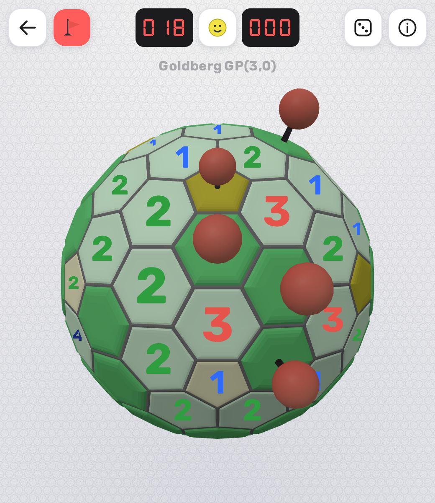
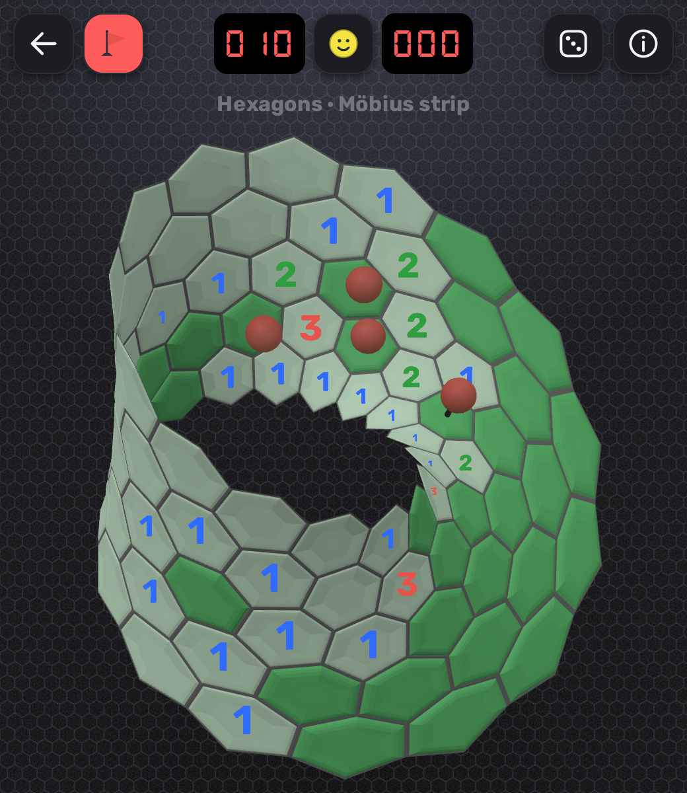
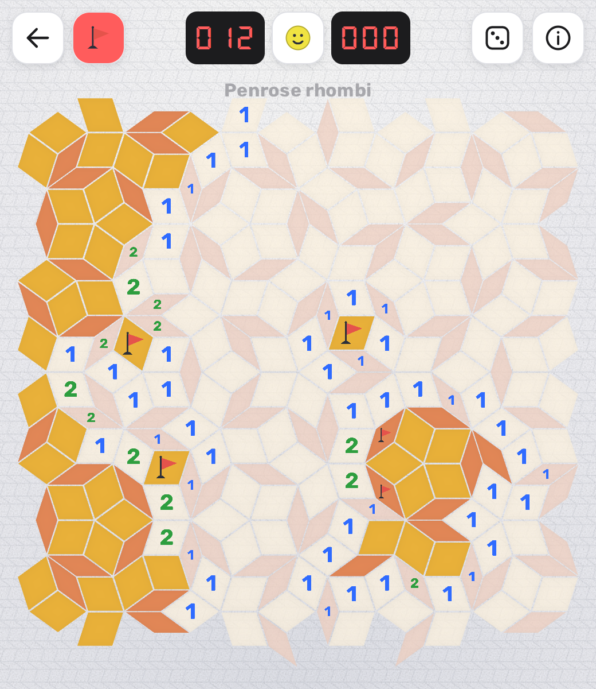
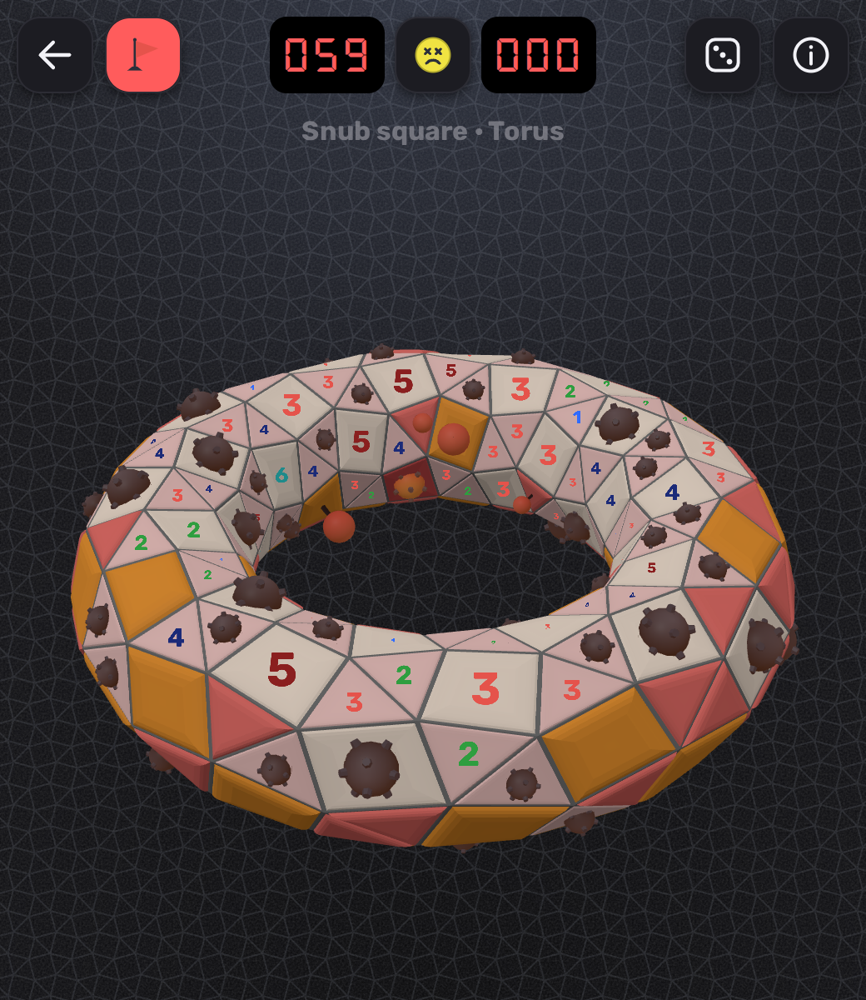
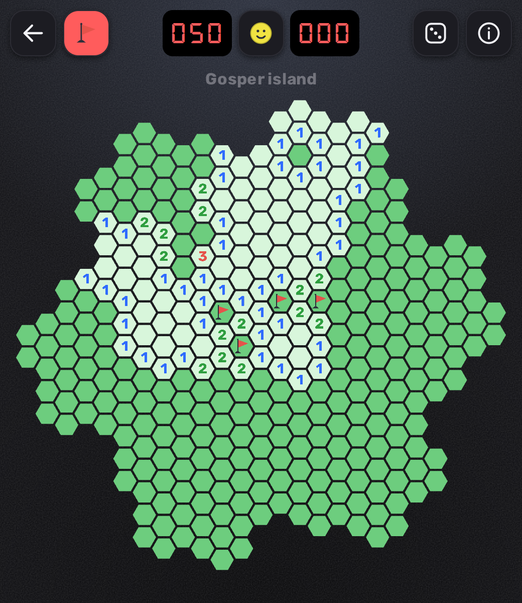
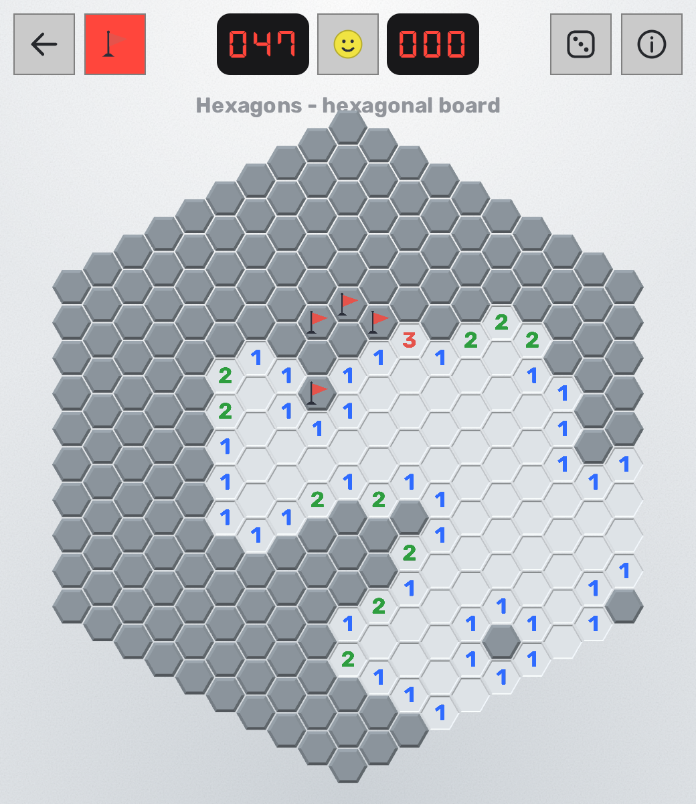
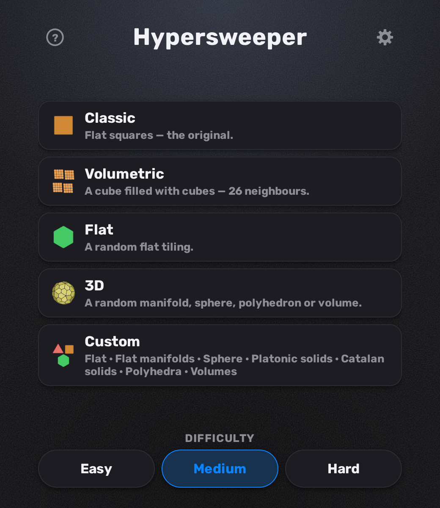
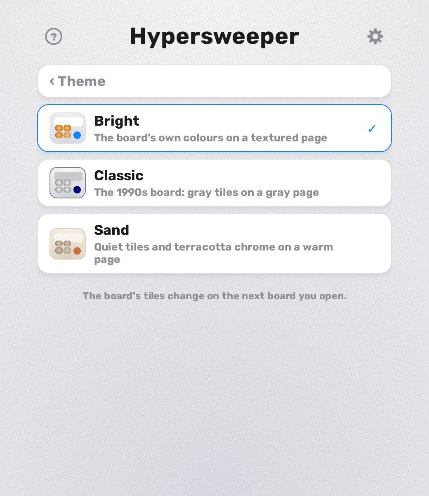
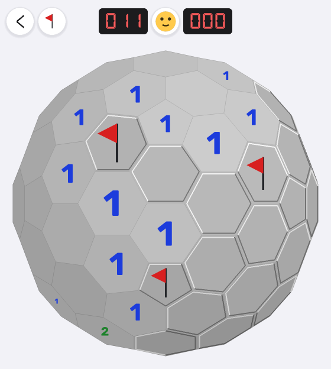

# Hypersweeper

Classic minesweeper, but the board can be almost any surface and tiling —
from a flat aperiodic Penrose mosaic to a Goldberg sphere or a Möbius strip.

**Play in the browser:** <https://hypersweeper.pages.dev/>
(the TypeScript/WebGL app in [`web/`](web), deployed from master by GitHub
Actions; installable, and it works offline once loaded)

<table>
  <tr>
    <td align="center"><br>Goldberg GP(3,0) on a sphere <sub>· Realistic, light</sub></td>
    <td align="center"><br>Hexagons on a Möbius strip <sub>· Realistic, dark</sub></td>
  </tr>
  <tr>
    <td align="center"><br>Penrose rhombi <sub>· Realistic, light</sub></td>
    <td align="center"><br>Snub square on a donut, boom <sub>· Realistic, dark</sub></td>
  </tr>
  <tr>
    <td align="center"><br>Hexagons in a Gosper island <sub>· Flat, dark</sub></td>
    <td align="center"><br>A hexagon of hexagons <sub>· Classic, light</sub></td>
  </tr>
  <tr>
    <td align="center"><br>The menu <sub>· Realistic, dark</sub></td>
    <td align="center"><br>Three themes — the page and how a cell is cut — over three colour schemes</td>
  </tr>
</table>

Pick a surface, then a tiling:

- **Flat surface** — classic squares (8 neighbors), a triangle grid (12)
  and the same triangles cut to a triangular or a hexagonal board,
  hexagons (6) and a big hexagon composed of small hexagons (6); the eight
  non-regular uniform tilings: snub hexagonal 3.3.3.3.6, elongated
  triangular 3.3.3.4.4, snub square 3.3.4.3.4, rhombitrihexagonal
  3.4.6.4, trihexagonal 3.6.3.6, truncated hexagonal 3.12.12, truncated
  trihexagonal 4.6.12 and truncated square 4.8.8 — and their eight Laves
  (dual) tilings, from Cairo pentagonal and rhombille to the kisrhombille.
  Then, tiled by one congruent rectangle rather than by regular polygons,
  the five brick bonds — stacked bond, running bond, basket weave, the same
  weave three bricks at a time, and herringbone — where all the interest is
  in how the courses are staggered. Three tilings have no translation at
  all: a Penrose mosaic (P3 rhombi), "the spectre" (Tile(1,1)), the *chiral*
  monotile whose tiling uses rotations only and never mirrors a tile, and a
  phyllotactic spiral of one equilateral hexagon in five arms. Five more are
  self-similar — one tile inflated into a patch shaped like itself: the
  sphinx, the chair, the Sierpiński carpet, the pentaflake, and hexagons
  filling a Gosper island.
  The menu groups these as **Regular**, **Uniform**, **Laves**, **Isogonal**
  (six tilings by regular polygons that are *not* edge to edge — a tile's
  corner in the middle of its neighbour's edge), **Congruent rectangles**,
  **Aperiodic** and **Fractals**; every periodic family also wraps the
  cylinder and the torus below, and — unless the tiling is chiral — the
  Möbius strip and the Klein bottle too
- **Sphere (3D)** — a chamfered dodecahedron (12 pentagons + 30 hexagons),
  the Goldberg polyhedron GP(3,0) (12 pentagons + 80 hexagons), a geodesic
  icosahedron (80 triangles), a snub dodecahedron
  (12 pentagons + 80 triangles), a rhombicosidodecahedron or a truncated
  icosidodecahedron — each rounded onto the sphere itself.
  (A sphere cannot be tiled with hexagons alone — Euler's formula
  forces 12 pentagons in.)
- **Platonic solids (3D)** — the five regular solids, each tiled with
  triangles or squares, flat and creased at the edges rather than rounded
  onto a sphere: a tetrahedron (4 faces), a cube (6, squares), an octahedron
  (8), a dodecahedron (12 pentagons, each fanned into 5 triangles from its
  own centre) and an icosahedron (20)
- **Catalan solids (3D)** — all thirteen duals of the Archimedean solids,
  flat-faced, each face cut into smaller copies of itself to make a board:
  the triakis tetrahedron, rhombic dodecahedron, triakis octahedron,
  tetrakis hexahedron, deltoidal icositetrahedron, pentagonal
  icositetrahedron, disdyakis dodecahedron, rhombic triacontahedron, triakis
  icosahedron, pentakis dodecahedron, deltoidal hexecontahedron, pentagonal
  hexecontahedron (60 pentagons, 7 neighbors) and disdyakis triacontahedron.
  Unlike the Archimedean solids these are *face*-transitive — one congruent
  face throughout, and no face regular: golden rhombi, kites, scalene
  triangles, irregular pentagons
- **Polyhedra (3D)** — a tetrahedron frame (a level-1 Sierpiński
  tetrahedron: the middle triangle removed from each face, leaving four
  corner tetrahedra that meet at the edge midpoints), a cube frame (a cube
  with a square tunnel bored through each pair of opposite faces — a level-1
  Menger sponge, genus 5), a stepped pyramid (square terraces narrowing to a
  single-cell apex, its foundation itself a playable face since nothing
  mirrors it below), and a stepped bipyramid (two of those pyramids stitched
  base-to-base into a terraced diamond). Cells stitch across the edges where
  faces meet, inner walls and step shoulders included. Three more are the
  same cube laid in **brick bonds** — stacked bond, basket weave and its
  three-brick version, the three congruent-rectangle bonds whose block is a
  square and so fills a square face. A brick cannot run round a corner, so
  the courses break at some of the twelve edges; the bricks either side still
  meet as neighbours
- **Volumetric (3D)** — a cube *filled* with cubes rather than a surface of
  them: an n×n×n block where a cell's neighbours are the 26 cubes that share a
  corner with it, against 21 for the densest surface here. A solid shows only
  its shell, so the cube is played taken apart — each slice is its own sheet of
  tiles, laid out side by side and stepped back in depth, so every cell is
  readable at once (a number spans three slices, and you need all three). The
  header's controls turn the solid itself, which is the one move dragging
  cannot make: dragging turns the drawing, and the drawing is the cube pulled
  apart rather than the cube
- **Torus (3D)** — the grid wraps in both directions, so there are no
  border cells; pure hexagons are possible here, because the torus has
  Euler characteristic 0
- **Double torus (3D)** — two donuts merged into a figure of eight, set so
  that a point of each one's outer rim lies on the other's inner rim: they
  overlap in a lens of real volume rather than touching. Each gives up
  everything it puts on the other's side and the two are sewn together along
  the plane between them, so away from the waist every cell is the donut's own
- **Möbius strip (3D)** — a one-sided surface: the strip glues to itself
  with a flip, so a chiral tiling cannot wrap it at all
- **Klein bottle (3D)** — the donut glued with that same flip, one-sided
  and closed; the immersion hides cells behind its own neck, so the board
  scrolls to bring them round
- **Cylinder (3D)** — an open tube, wrapping in one direction only

## Playing

- **Left-click / tap** — reveal a cell (the first reveal always opens an
  empty area); click a revealed number to chord
- **Right-click**, **long-press**, or the flag button in the header —
  toggle a flag
- **Face button** — new game; the **`<` button** goes back to the menu
- **Drag** a 3D board to turn it (arrow keys too); **pinch** or
  <kbd>ctrl</kbd>+wheel to zoom any board, <kbd>0</kbd> to frame it again
- On a Klein bottle, the **chevrons** (or <kbd>[</kbd> / <kbd>]</kbd>)
  scroll the board round its neck

Every board is a **link** — `?mode=…&difficulty=…`, plus a `seed` to share
the exact layout. Winning files the time: the fastest three per board and
difficulty live under Settings › Best times. It also files an **achievement**
where there is one to file — fifty-two of them, and none written by hand: they
are the catalogue's own structure, one per kind of tile a board can be made of
(triangles through 13-gons), one for playing a tiling family and one for
finishing it, the same pair for each surface and each group of solids, and one
for the lot. The card that goes up on a win says what it just unlocked and links
to the rest, under Settings › Achievements. Settings also holds the
three themes (the page behind the board and how its cells are cut) over
three colour schemes (auto, following the device, plus light and dark),
three sound presets (synthesised from the move that caused them — a tile's
side count is its voice) with a volume slider, an animations toggle, and —
on a phone that can buzz — a haptics switch.

The hosted game counts, anonymously, which boards get opened and how they go
— the board and difficulty, whether it was won and how long it took, how far
the board got and how the flags fell, how the game was started, and whether
this is a phone, tablet or desktop. No account, no cookie, no identifier, and
nothing about the request itself (no IP, no country, no user agent), so there
is no way to link two games. The switch is Settings › Privacy › Analytics. The
macOS and iPhone apps send nothing at all: they are built without the
collector, not merely with it switched off.

## Development

The game is a TypeScript/Three.js app in [`web/`](web):

```sh
cd web
npm install
npm run dev          # http://localhost:5173
npm run typecheck    # tsc
npm run test         # vitest unit tests
npm run e2e          # Playwright e2e + visual regression
npm run build        # production bundle into web/dist
npm run screenshots  # regenerate the gallery above
```

### A Mac app that plays offline

```sh
make mac-app       # build/desktop/mac*/Hypersweeper.app  (run this on a Mac)
make mac-app-dmg   # …and a drag-to-Applications .dmg
```

The same game, packaged with everything it draws — bundle, fonts, icons,
board data — inside the app, so it needs no internet connection at all.
The build proves that rather than promising it: it refuses to package a
bundle that references a remote URL, and then launches the app it built
with the network cut. See [`desktop/README.md`](desktop/README.md).

### An iPhone app that buzzes

```sh
make ios-app       # build the game and open the project in Xcode  (on a Mac)
make ios-run       # …or build straight onto a connected iPhone
```

The same game again, wrapped in a Capacitor WKWebView so it installs on a
phone and plays offline — and, being native, can reach the **Taptic
Engine**: a light tick when a flag lands, the system's sharp error buzz
when you step on a mine, its success buzz when the board falls. No web API
on iOS can ask for that. Building it needs a Mac with Xcode; a free Apple
ID signs it for 7 days at a time. See [`ios/README.md`](ios/README.md).

[`web/AGENTS.md`](web/AGENTS.md) is the guide to the code — the renderer,
the board builders, themes, sound, and how to drive the app headless;
[`web/README.md`](web/README.md) is its milestone history.
[`data/*.json`](data) is shared configuration (the board catalog, presets,
UI screens) that both implementations read, plus a conformance oracle
exported from the Python game and replayed by the TypeScript tests, so the
two can never disagree about the rules.

## The pygame implementation



The original game is a Python/pygame app and stays in the repo as the
**reference implementation** — the behaviour the TypeScript port is checked
against, and the place `data/*.json` is exported from. It is no longer
deployed to the web; the site root serves the TypeScript app (`/next/`,
where that app lived during the rewrite, redirects there).

```sh
pip install -r requirements.txt
python3 -m minesweeper                 # menu
python3 -m minesweeper --mode hex      # skip the menu
python3 -m minesweeper --theme paper   # one of the six pygame themes
```

Controls match the web app; `n` starts a new game, `1` / `2` / `3` switch
difficulty and `Escape` goes back to the menu.

```sh
make venv     # create .venv with every dependency group
make test     # pytest
make lint     # ruff
make run      # desktop game
make web-run  # the pygbag browser build at http://localhost:8000
make help     # everything else
```

Code layout: `minesweeper/game.py` holds the rules over an arbitrary
cell graph; `minesweeper/boards/` generates the tilings (cell
vertices get exact hashable ids — lattice points in 2D, symbolic keys
in 3D — and two cells are neighbors when they share a vertex); the
sphere is built with the Conway gyro operation on an icosahedron;
`minesweeper/gui.py` is the pygame interface, including the rotatable
orthographic 3D view. Tests run headless via SDL's dummy video driver.

## License

[MIT](LICENSE) — copy it, fork it, build something else on top of it,
commercially or not; the one condition is that the copyright notice comes
along. The game itself is free.

Most of it was written with AI assistance.

The two bundled fonts are not covered by that license. Rubik (© 2015 The Rubik
Project Authors) and DSEG7 Classic (© 2017 keshikan) are both under the SIL
Open Font License 1.1, and their license texts ship next to the font files in
[`minesweeper/assets/fonts/`](minesweeper/assets/fonts) — mirrored into
[`web/public/fonts/`](web/public/fonts) so the browser app is self-contained
offline.
